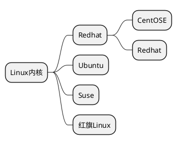

# Linux 学习笔记

**学习流程**
第一阶段：Linux 环境下的基本操作命令，包括文件操作命令`rm mkdir chomod chown`编辑工具使用 (vi vim) Linux 用户管理 (useradd userdel usermod) 等
第二阶段：Linux 各种配置（环境变量 网路 服务）
第三阶段：Linux 下如何搭建对应语言的开发环境（大数据 JavaEE Python)
第四阶段：能写 shell 脚本，对 Linux 服务器进行维护
第五阶段：能进行安全设置，防止攻击，保障服务器正常运行，能对性能调优
第六阶段：深入理解 Linux 系统（对内核有研究），熟练掌握大型网站应用架构组成，并熟悉各个环节的部署和维护方法

## 基础篇

