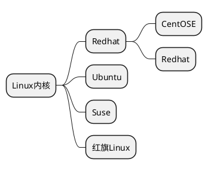

# Linux 学习笔记

**学习流程**
第一阶段：Linux 环境下的基本操作命令，包括文件操作命令`rm mkdir chomod chown`编辑工具使用 (vi vim) Linux 用户管理 (useradd userdel usermod) 等
第二阶段：Linux 各种配置（环境变量 网路 服务）
第三阶段：Linux 下如何搭建对应语言的开发环境（大数据 JavaEE Python)
第四阶段：能写 shell 脚本，对 Linux 服务器进行维护
第五阶段：能进行安全设置，防止攻击，保障服务器正常运行，能对性能调优
第六阶段：深入理解 Linux 系统（对内核有研究），熟练掌握大型网站应用架构组成，并熟悉各个环节的部署和维护方法

## 基础篇



### VM 和 Linux 系统 (CentOS) 安装

#### 虚拟机的网络连接三种形式

1. 桥连接，Linux 可以和其他的系统互相通信，但是可能造成 ip 冲突（因为 ip 只能 2-254)
2. NAT：Linux 可以访问外网，不会造成 ip 冲突，但外网无法访问 Linux
3. 主机模式：将 Linux 作为独立主机，不与外网互相访问

在 Linux 系统中，一切皆文件

### 实操篇

#### 远程登录到 Linux 系统

两个软件

- Xshell
- Xftp

设置好 ip 即可远程访问`使用ifconfig查看ip地址`

#### Vi 和 Vim 编辑器 (vim 是 vi 的升级版）

Vi 和 Vim 的三种常见模式

1. 正常模式
正常模式下可以使用快捷键
2. 编辑模式
输入 i 进入，可以输入内容
3. 命令行模式
可以保存、退出

```linux
ll  显示当前路径下文件详细信息
ls  显示当前路径下文件名
pwd 查看当前路径
ESC 退出编辑模式回到正常模式
:wq 保存退出
:q  未修改退出
:q! 已修改强制退出
/关键字 查找'关键字'    输入n就是查找下一个
u   撤销操作
yy  拷贝当前行
p   粘贴
5yy 拷贝从当前行开始数5行
dd  删除当前行
5dd 删除从当前行开始数5行
:set nu 设置文件行号
:set nonu   取消文件行号
gg  跳到文件头
G   跳到文件尾
行号G   跳到指定行
```

#### 关机、重启、用户登录注销

```linux
shutdown
    shutdown -h now 立即关机
    shutdown -h 1   1分钟后关机
    shutdown -r now 立即重启
halt    关机
reboot  重启
sync    把内存数据同步到磁盘

logout  注销 下图形运行级别无效，在运行级别3下有效
运行级别之后会讲到
```

#### 用户管理

这个指令会默认创建一个与‘用户名’同名的组，并将小明放入组中

```linux
useradd 用户名              添加用户
useradd -d 新路径 用户名    指定新用户的存放组(新用户位于home下)
passwd 用户名                给指定用户添加密码
```
