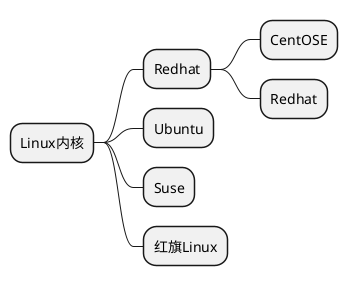

# Linux 学习笔记<!-- omit in toc -->

- [1. 基础篇](#1-基础篇)
  - [1.1. VM 和 Linux 系统 (CentOS) 安装](#11-vm-和-linux-系统-centos-安装)
    - [1.1.1. 虚拟机的网络连接三种形式](#111-虚拟机的网络连接三种形式)
- [2. 实操篇](#2-实操篇)
  - [2.1. 远程登录到 Linux 系统](#21-远程登录到-linux-系统)
  - [2.2. Vi 和 Vim 编辑器 (vim 是 vi 的升级版）](#22-vi-和-vim-编辑器-vim-是-vi-的升级版)
  - [2.3. 关机、重启、用户登录注销](#23-关机重启用户登录注销)
  - [2.4. 用户管理](#24-用户管理)
    - [2.4.1. 用户组](#241-用户组)
    - [2.4.2. 用户和组的相关文件](#242-用户和组的相关文件)
  - [2.5. 实用指令](#25-实用指令)
    - [2.5.1. 指令的运行级别](#251-指令的运行级别)
    - [2.5.2. 帮助指令](#252-帮助指令)
    - [2.5.3. 文件目录类](#253-文件目录类)

**学习流程**
第一阶段：Linux 环境下的基本操作命令，包括文件操作命令`rm mkdir chomod chown`编辑工具使用 (vi vim) Linux 用户管理 (useradd userdel usermod) 等
第二阶段：Linux 各种配置（环境变量 网路 服务）
第三阶段：Linux 下如何搭建对应语言的开发环境（大数据 JavaEE Python)
第四阶段：能写 shell 脚本，对 Linux 服务器进行维护
第五阶段：能进行安全设置，防止攻击，保障服务器正常运行，能对性能调优
第六阶段：深入理解 Linux 系统（对内核有研究），熟练掌握大型网站应用架构组成，并熟悉各个环节的部署和维护方法

## 1. 基础篇



### 1.1. VM 和 Linux 系统 (CentOS) 安装

#### 1.1.1. 虚拟机的网络连接三种形式

1. 桥连接，Linux 可以和其他的系统互相通信，但是可能造成 ip 冲突（因为 ip 只能 2-254)
2. NAT：Linux 可以访问外网，不会造成 ip 冲突，但外网无法访问 Linux
3. 主机模式：将 Linux 作为独立主机，不与外网互相访问

在 Linux 系统中，一切皆文件

## 2. 实操篇

### 2.1. 远程登录到 Linux 系统

两个软件

- Xshell
- Xftp

设置好 ip 即可远程访问`使用ifconfig查看ip地址`

### 2.2. Vi 和 Vim 编辑器 (vim 是 vi 的升级版）

Vi 和 Vim 的三种常见模式

1. 正常模式
正常模式下可以使用快捷键
2. 编辑模式
输入 i 进入，可以输入内容
3. 命令行模式
可以保存、退出

```linux
ll  显示当前路径下文件详细信息
ls  显示当前路径下文件名
pwd 查看当前路径
ESC 退出编辑模式回到正常模式
:wq 保存退出
:q  未修改退出
:q! 已修改强制退出
/关键字 查找'关键字'    输入n就是查找下一个
u   撤销操作
yy  拷贝当前行
p   粘贴
5yy 拷贝从当前行开始数5行
dd  删除当前行
5dd 删除从当前行开始数5行
:set nu 设置文件行号
:set nonu   取消文件行号
gg  跳到文件头
G   跳到文件尾
行号G   跳到指定行
```

### 2.3. 关机、重启、用户登录注销

```linux
shutdown
    shutdown -h now 立即关机
    shutdown -h 1   1分钟后关机
    shutdown -r now 立即重启
halt    关机
reboot  重启
sync    把内存数据同步到磁盘

logout  注销 下图形运行级别无效，在运行级别3下有效
运行级别之后会讲到
```

### 2.4. 用户管理

`useradd xm`这个指令会默认创建一个与‘xm’同名的文件夹，并将 xm 放入文件夹中

```linux
useradd 用户名              添加用户
useradd -d 新路径 用户名    指定新用户的存放路径(新用户目录位于home下)
passwd 用户名               给指定用户添加密码
userdel 用户名              删除用户(会保留用户目录)
rm -rf /home/用户目录/        删除用户之后删除目录
userdel -r 用户名           删除用户(同时删除用户目录)
//实际应用中一般保留家目录
```

```linux
id 用户名                   查询用户信息
su - 用户名                 切换用户
//高权限用户进入低权限用户不需要密码，exit可返回
whoami                      查看当前所在目录
```

#### 2.4.1. 用户组

```linux
groupadd 组名               添加组
groupdel 组名               删除组
useradd -g 用户组 用户名    新建用户时加入到已存在的组
usermod -g 用户组 用户名    修改用户的组
```

#### 2.4.2. 用户和组的相关文件

- /etc/passwd
    用户的配置文件，记录用户的各种信息
    每行含义：
    > 用户名：口令：用户标识号：注释性描述：主目录：登录 shell

- /etc/shadow
    口令的配置文件
    每行含义：
    > 登录名：加密口令：最后一次修改时间：最小时间间隔：最大时间间隔：警告时间：不活动时间：失效时间：标志

- /etc/group
    组的配置文件，记录 linux 包含的组的信息
    每行含义：
    > 组名：口令：组标识号：组内用户列表

### 2.5. 实用指令

#### 2.5.1. 指令的运行级别

常用的运行级别是 3 和 5

0. 关机
1. 单用户（找回丢失密码）
2. 多用户无网络服务
3. 多用户有网络服务
4. 保留
5. 图形界面
6. 重启

centos7 以上用`systemctl`指令修改

#### 2.5.2. 帮助指令

基本语法：

```linux
man 命令或配置文件
help 命令或配置文件
```

#### 2.5.3. 文件目录类

```linux
pwd                       显示当前路径
ls -a                     查看包括隐藏文件在内的所有文件和目录
ls -l                     以列表方式显示信息(可简写为ll)
cd 或 cd~                 切换到家目录
cd..                      返回上级目录
mkdir -p                  创建新目录
rmdir                     删除空目录
rm -rf                    删除非空目录(递归删除文件夹，强制删除不提示)
touch                     创建空文件，可以一次性创建多个文件
cp 文件名 目标目录         拷贝文件
cp -r 文件名 目标目录类    递归拷贝文件夹
\cp                       拷贝并覆盖
mv 文件名 新文件名         重命名文件
mv 文件名 目标目录         移动文件
cat -n 文件名             查看文件内容(-n是显示行号)
```

> cat只能浏览文件不能修改文件，为了方便浏览，通常会带上管道命令`| more`

```linux
more                      全屏的方式按页显示文件内容
less                      动态加载显示内容(对于显示大型文件有较高效率)
```

```cpp
>                       输出重定向
>>                      追加
ls -l > 文件名          列表显示内容写入到文件中（覆盖写）
ls -al >> 文件          列表显示内容追加到文件中
cat 文件1 > 文件2       将文件1的内容覆盖到文件2（2被清空）
echo "内容" >> 文件      追加内容到文件
echo "内容" > 文件      覆盖内容到文件
```
